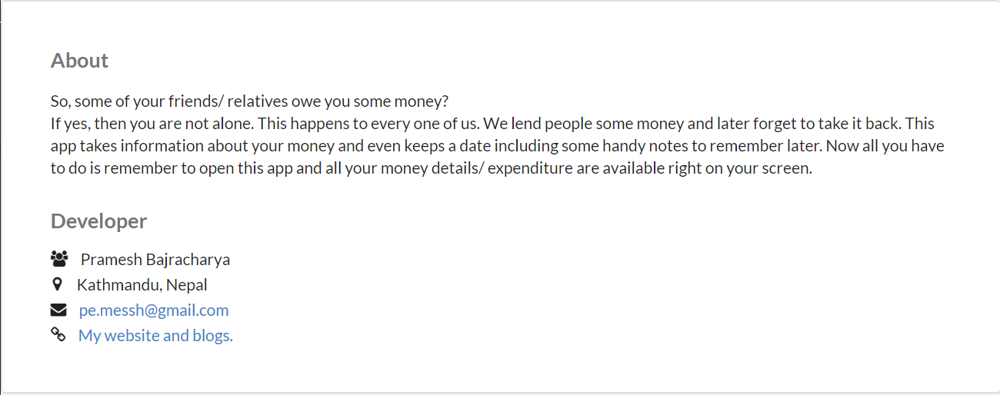

# Expensify app 

<h6>Uses React + Semantic UI + Bootstrap + Redux + Firebase</h6>

# Run this by :

- `npm install` install required dependancies.

- `npm start` run in local dev mode.

- By default runs on `css`. To run from `scss` run `npm run watch-css`

 

# App Currently in DEVELOPMENT MODE

 

- No complete test coverage

